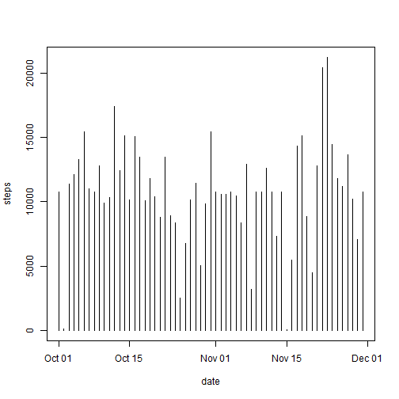

Peer Assessment 1
=================


Loading and preprocessing the data
----------------------------------


```r
unzip("activity.zip")
activity <- read.csv("activity.csv")
activity$date <- as.Date(activity$date, "%Y-%m-%d")
```

What is mean total number of steps taken per day?
-------------------------------------------------

Make a histogram of the total number of steps taken each day


```r
table <- aggregate(activity$steps ~ activity$date, data = activity, FUN = sum)
colnames(table) <- c("date", "steps")

Sys.setlocale(locale = "C")
```

```
## [1] "C"
```

```r
plot(steps ~ date, table, type = "h")
```

 


The mean and median total number of steps taken per day


```r
mean(table$steps)
```

```
## [1] 10766
```

```r
median(table$steps)
```

```
## [1] 10765
```

What is the average daily activity pattern?
-------------------------------------------

Make a time series plot (i.e. type = "l") of the 5-minute interval (x-axis) and the average number of steps taken, averaged across all days (y-axis)


```r
table2 <- aggregate(activity$steps ~ activity$interval, data = activity, FUN = mean)
colnames(table2) <- c("interval", "steps")
plot(steps ~ interval, table2, type = "l")
```

 


Which 5-minute interval, on average across all the days in the dataset, contains the maximum number of steps?


```r
table2$interval[table2$steps == max(table2$steps)]
```

```
## [1] 835
```


Imputing missing values
-----------------------

The total number of missing values in the dataset (i.e. the total number of rows with NAs)


```r
na_num <- 0
for (i in 1:nrow(activity)) {
    
    if (is.na(activity[i, 1])) {
        na_num <- (na_num + 1)
    }
    
}

print(na_num)
```

```
## [1] 2304
```


The strategy for filling in the missing values in the dataset is the mean for that 5-minute interval.


```r

activityNew <- activity

for (i in 1:nrow(activityNew)) {
    if (is.na(activityNew[i, 1])) 
        activityNew[i, 1] <- table2[table2[1] == activityNew[i, 3]][2]
    
}
```

activityNew is a new data set without missing values

The histogram of the total number of steps taken each day


```r
totalsteps <- aggregate(activityNew$steps ~ activityNew$date, data = activityNew, 
    FUN = sum)
colnames(totalsteps) <- c("date", "steps")
plot(steps ~ date, totalsteps, type = "h")
```

 


The mean and median total number of steps taken per day


```r
mean(totalsteps$steps)
```

```
## [1] 10766
```

```r
median(totalsteps$steps)
```

```
## [1] 10766
```


Are there differences in activity patterns between weekdays and weekends?
-------------------------------------------------------------------------

Create a new factor variable in the dataset with two levels  weekday and weekend indicating whether a given date is a weekday or weekend day.


```r
wd <- activity$date
wd <- strptime(wd, "%Y-%m-%d")
wd <- weekdays(wd)
wd <- as.character(wd)

for (i in 1:length(wd)) {
    if (wd[i] == "Saturday" | wd[i] == "Sunday") {
        wd[i] <- "weekend"
    } else {
        wd[i] <- "weekday"
    }
}
wd <- factor(wd)

activityNew$wd <- wd
```


Make a panel plot containing a time series plot (i.e. type = "l") of the 5-minute interval (x-axis) and the average number of steps taken, averaged across all weekday days or weekend days (y-axis).


```r
table3 <- aggregate(activityNew$steps ~ activityNew$interval + activityNew$wd, 
    data = activityNew, FUN = mean)
colnames(table3) <- c("interval", "wd", "steps")


library(lattice)
xyplot(steps ~ interval | wd, table3, layout = c(1, 2), type = "l", xlab = "Interval", 
    ylab = "Number of steps")
```

 

